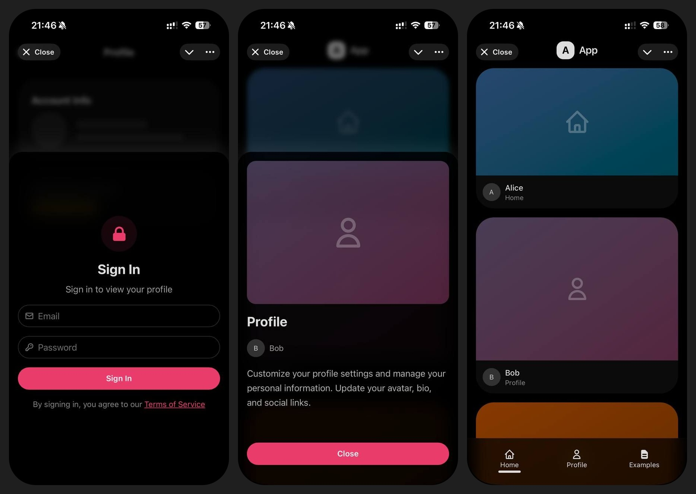

# Perfect App Template



## Features

- Vue 3 with JSX syntax
- TypeScript strict mode
- Bun runtime
- Tailwind CSS v4 + DaisyUI v5
- Dark/light theming
- i18n with ICU message syntax
- iOS-style page transitions
- Modal system with multi-step flows
- Bottom dock navigation
- Route guards (auth, verification)
- Pinia stores with persistence
- Plugin architecture with tree-shaking
- Platform adapters (Browser, TMA, PWA)
- Interactive examples library

## Quick Start

```bash
bun install
bun run dev
```

## Scripts

- `bun run dev` - Start dev server
- `bun run build` - Type-check and build for production
- `bun run preview` - Preview production build
- `bun run check` - Format, lint, and organize imports

## Tech Stack

- **Bun** - Runtime and package manager
- **Vue 3** - JSX syntax (not SFCs)
- **TypeScript** - Strict mode
- **Vite** - Build tooling (via rolldown-vite)
- **Tailwind CSS v4** + **DaisyUI v5**
- **Biome** - Formatting and linting
- **Vue Router** - Routing
- **Pinia** - State management
- **FormatJS** - i18n
